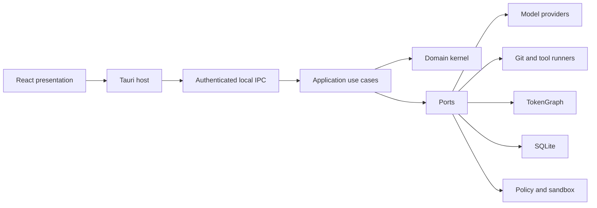

# Kesharon Product Architecture

## Scope

Kesharon v1 is a local, single-user, Code-first desktop agent. It opens local
Git repositories, plans tasks, requests permission, executes approved steps in
managed worktrees, and presents diffs, tests, events, and resource use for
review.

Accounts, synchronization, team administration, an always-on operating-system
service, a public plugin marketplace, and browser-centric Work workflows are
outside the first MVP.

## Runtime boundaries



The React presentation is unprivileged. The Tauri host owns window, tray,
updater, capabilities, and daemon lifecycle concerns. The daemon is a modular
Rust process that owns use cases and composes infrastructure adapters around
the domain.

## Dependency rule

```text
UI -> Protocol
Tauri host -> Protocol
Daemon composition -> Application + Adapters
Adapters -> Application ports
Application -> Domain
Domain -> Rust standard library only
```

Dependencies point inward. Infrastructure data is translated at adapter
boundaries; framework types never enter domain entities or application use
cases.

## Local IPC

The host and daemon communicate over a same-user named pipe on Windows and a
Unix-domain socket with mode `0600` on macOS and Linux.

- Each launch uses a random 256-bit authentication token delivered through the
  sidecar's initial standard input.
- Frames contain a four-byte big-endian length followed by UTF-8 JSON.
- A frame may not exceed 8 MiB.
- Requests, responses, and events carry a protocol version.
- Events carry monotonic sequence numbers.
- Mutations carry idempotency keys.
- A sequence gap causes a snapshot refresh rather than inferred state.

## Storage

`state.db` is user-owned durable state. `graph.db` is reproducible repository
intelligence. Secrets remain in the operating system credential store, with
only opaque references persisted.

SQLite uses foreign keys, WAL, `synchronous=NORMAL`, a busy timeout, migrations,
coalesced writes, and online backup. Unchanged content hashes suppress writes.
Diagnostic logs and temporary artifacts are bounded and disposable.

## Trust and execution

Permission modes are Read-only, Workspace write, Networked task, and
Elevated/native automation. A policy decision combines task mode, trusted
roots, resolved paths, network destinations, secret access, reversibility, and
isolation tier.

Git worktrees isolate repository mutations. Restricted native execution is
available for trusted work; Docker or Podman is an optional stronger isolation
tier. The UI must state the active isolation level accurately.

## Provider and intelligence boundaries

Providers expose a capability matrix instead of a lowest-common-denominator
wrapper. The first adapters target OpenAI, Anthropic, and OpenAI-compatible
local endpoints.

TokenGraph v1 provides semantic indexing for TypeScript/JavaScript, Python, and
Rust, plus lexical and Git-aware retrieval for other text files. Indexing is
incremental, content-addressed, debounced, and limited to two workers by
default.
